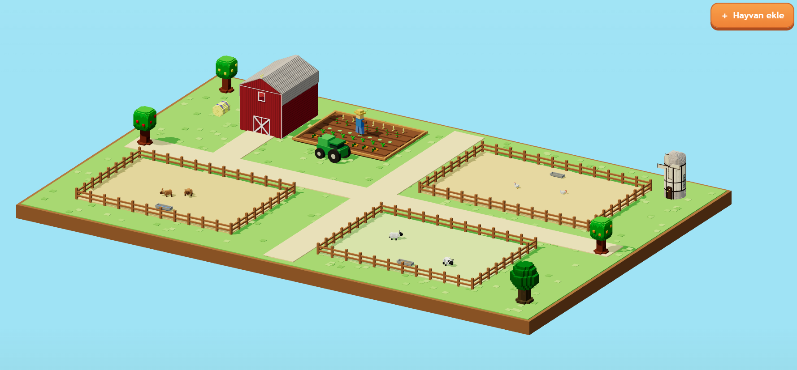
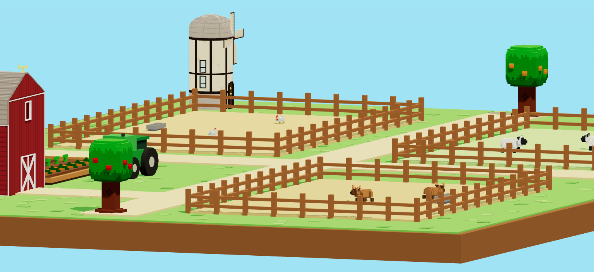
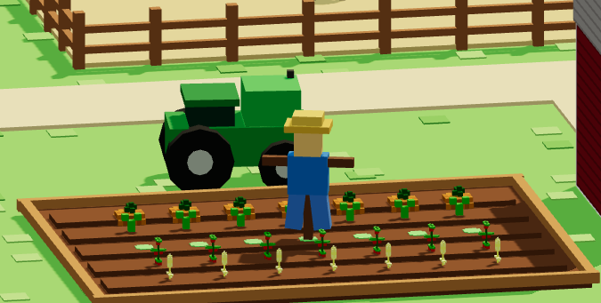
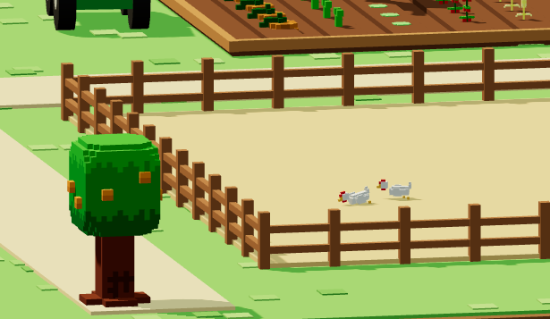

# Hayvan Çiftliği

Spring Boot REST API ve Three.js kullanılarak geliştirilmiş bir çiftlik yönetim uygulaması. Keçi, koyun ve tavuklar uygulama belleğinde birer nesne olarak tutulur ve web arayüzündeki üç boyutlu yaşam alanlarında görüntülenir.

[](https://animal-farm-3fio.onrender.com/)
[](https://animal-farm-3fio.onrender.com/swagger-ui.html)



> Ücretsiz sunucu kullanılmadığında uykuya geçebilir; canlı demonun ilk açılışı yaklaşık bir dakika sürebilir.

## Özellikler

- Keçi, koyun ve tavuk türlerini ve hayvan sayılarını listeleme
- Bir türe ait hayvanları görüntüleme
- Hayvan ekleme, güncelleme ve silme
- Türe göre kapasite kontrolü
- Bellek içi veri saklama
- Doğrulama ve merkezi hata yönetimi
- Swagger UI üzerinden REST API dokümantasyonu ve testi
- Three.js tabanlı üç boyutlu çiftlik arayüzü

## Ekran görüntüleri

| Hayvan yaşam alanları | Tarla ve çiftçi |
|---|---|
|  |  |



## Proje yapısı

- [`domain`](src/main/java/com/elif/hayvanciftligi/domain): Hayvan sınıfları, türler ve nesne üretimi
- [`repository`](src/main/java/com/elif/hayvanciftligi/repository): Bellek içi veri saklama işlemleri
- [`service`](src/main/java/com/elif/hayvanciftligi/service): İş kuralları ve kapasite kontrolleri
- [`controller`](src/main/java/com/elif/hayvanciftligi/controller): REST API uç noktaları
- [`dto`](src/main/java/com/elif/hayvanciftligi/dto): API istek ve cevap modelleri
- [`exception`](src/main/java/com/elif/hayvanciftligi/exception): Merkezi hata yönetimi
- [`config`](src/main/java/com/elif/hayvanciftligi/config): Swagger, web ve başlangıç verisi ayarları
- [`static`](src/main/resources/static): Web arayüzü ve üç boyutlu varlıklar
- [`test`](src/test/java/com/elif/hayvanciftligi): Birim ve entegrasyon testleri

## Kullanılan teknolojiler

- Java 17
- Spring Boot ve Spring Web MVC
- Bean Validation
- Springdoc OpenAPI / Swagger UI
- JUnit ve Spring Boot Test
- Three.js
- Maven

## Yerel çalıştırma

JDK 17 veya daha yeni bir sürüm gereklidir.

```bash
git clone https://github.com/rumeysaelif/animal-farm.git
cd animal-farm
```

Windows:

```powershell
.\mvnw.cmd spring-boot:run
```

Linux/macOS:

```bash
./mvnw spring-boot:run
```

Uygulama başladıktan sonra:

- Web arayüzü: <http://localhost:8080/>
- Swagger UI: <http://localhost:8080/swagger-ui.html>
- OpenAPI tanımı: <http://localhost:8080/v3/api-docs>

## REST API

| Metot | Adres | Açıklama |
|---|---|---|
| `GET` | `/api/animal-types` | Türleri ve tür başına hayvan sayısını getirir |
| `GET` | `/api/animal-types/{type}/animals` | Belirtilen türe ait hayvanları getirir |
| `GET` | `/api/animals` | Bütün hayvanları getirir |
| `GET` | `/api/animals/{id}` | ID ile bir hayvanı getirir |
| `POST` | `/api/animals` | Yeni hayvan ekler |
| `PUT` | `/api/animals/{id}` | Hayvan bilgilerini günceller |
| `DELETE` | `/api/animals/{id}` | Hayvanı siler |

Örnek istek:

```json
{
  "type": "GOAT",
  "name": "Boncuk",
  "gender": "FEMALE"
}
```

## Testler

```powershell
.\mvnw.cmd test
```

Üçüncü taraf görsel ve kod varlıklarının bilgileri [THIRD_PARTY_NOTICES.md](THIRD_PARTY_NOTICES.md) dosyasında yer alır.
